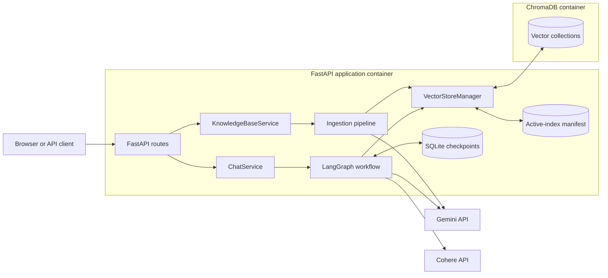
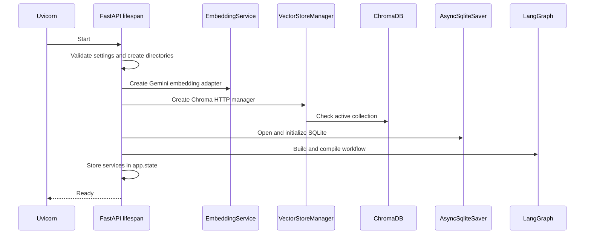
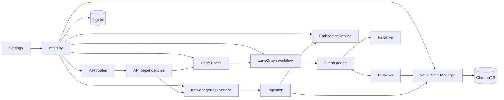
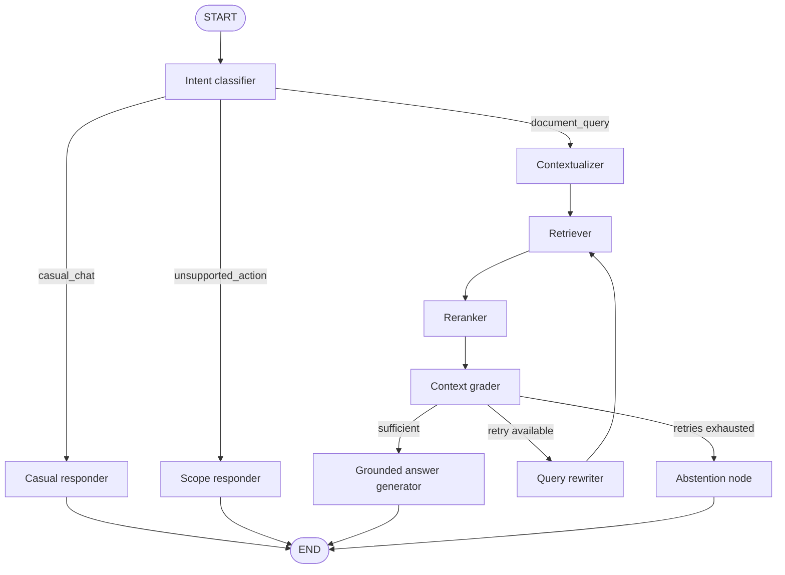
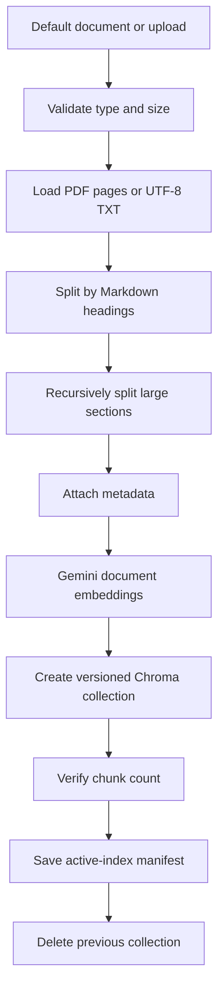

# Agentic RAG

A context-aware, document-grounded chatbot built with LangGraph, FastAPI, Gemini,
ChromaDB, and optional Cohere reranking.

The system classifies user intent, preserves conversation context, retrieves relevant
document chunks, reranks evidence, evaluates its sufficiency, and performs one bounded
query rewrite before abstaining.

## Features

- LangGraph state-machine orchestration
- Context-aware multi-turn conversations
- Intent routing that skips retrieval for casual messages
- Gemini generation and embeddings
- Persistent ChromaDB vector storage
- Optional Cohere reranking with automatic fallback
- Grounded answers with inline source citations
- PDF and UTF-8 TXT ingestion
- Section-aware Markdown chunking
- SQLite conversation checkpoints
- FastAPI and a browser interface
- Docker and strict `uv` dependency management

## Tech stack

| Component | Technology |
|---|---|
| API | FastAPI and Uvicorn |
| Agent orchestration | LangGraph `StateGraph` |
| LLM | Google Gemini 2.5 Flash |
| Embeddings | Gemini Embedding 001 |
| Vector database | ChromaDB |
| Reranker | Cohere Rerank 4 Fast |
| Conversation memory | LangGraph SQLite checkpointer |
| PDF extraction | PyMuPDF4LLM |
| Text splitting | LangChain text splitters |
| Validation and settings | Pydantic v2 and Pydantic Settings |
| Dependency management | `uv` |
| Containerization | Docker and Docker Compose |

## Quick start

### Requirements

- Docker with Docker Compose
- Gemini API key
- Cohere API key only when reranking is desired

### Environment

```bash
cp .env.example .env
```

Set the required key:

```env
GEMINI_API_KEY=your-gemini-api-key
```

Optionally enable Cohere:

```env
COHERE_API_KEY=your-cohere-api-key
```

Without a Cohere key, the application uses ChromaDB's vector-search ordering.

### Run with Docker

```bash
docker compose -f docker-compose.dev.yml up --build
```

Open:

```text
Application: http://localhost:8000
Swagger UI:  http://localhost:8000/docs
ChromaDB:    http://localhost:8100
```

A fresh deployment starts without an active index. Restore the bundled document through
the application or run:

```bash
curl -X POST http://localhost:8000/api/v1/knowledge-base/default
```

### Run locally with `uv`

Start ChromaDB:

```bash
docker compose -f docker-compose.dev.yml up -d chromadb
```

Install locked dependencies and start FastAPI:

```bash
uv sync --locked --extra dev
uv run uvicorn rag_chatbot.main:app --reload
```

## System architecture



### Startup composition



FastAPI lifespan is the composition root. It creates provider adapters, persistence,
services, and the compiled graph once, then exposes services through `app.state`.

## Folder structure

```text
Agentic-RAG/
├── data/
│   ├── documents/
│   │   └── andrej_karpathy.txt
│   ├── checkpoints/                  # SQLite and active-index manifest
│   └── vectorstore/
│
├── src/
│   └── rag_chatbot/
│       ├── main.py                   # FastAPI composition root
│       ├── config.py                 # Immutable environment settings
│       │
│       ├── api/
│       │   ├── dependencies.py       # FastAPI service injection
│       │   ├── routes/
│       │   │   ├── chat.py
│       │   │   ├── health.py
│       │   │   ├── knowledge_base.py
│       │   │   └── web.py
│       │   └── schemas/
│       │       ├── chat.py
│       │       └── knowledge_base.py
│       │
│       ├── core/
│       │   ├── exceptions.py
│       │   └── logging.py
│       │
│       ├── graph/
│       │   ├── state.py
│       │   ├── nodes.py
│       │   ├── prompts.py
│       │   └── workflow.py
│       │
│       ├── rag/
│       │   ├── embeddings.py
│       │   ├── ingestion.py
│       │   ├── retriever.py
│       │   ├── reranker.py
│       │   ├── vector_store.py
│       │   └── types.py
│       │
│       ├── services/
│       │   ├── chat.py
│       │   └── knowledge_base.py
│       │
│       └── web/
│           ├── templates/index.html
│           └── static/
│               ├── chat.js
│               └── styles.css
│
├── .env.example
├── Dockerfile
├── docker-compose.dev.yml
├── docker-compose.prod.yml
├── pyproject.toml
└── uv.lock
```

## Module dependency graph



## LangGraph workflow



### Graph state

| Field | Purpose |
|---|---|
| `messages` | Checkpointed conversation messages |
| `current_question` | Current user input |
| `intent` | Casual, document, or unsupported branch |
| `intent_confidence` | Structured classifier confidence |
| `intent_fast_path` | Whether exact rules skipped classification |
| `standalone_query` | Contextualized or rewritten query |
| `documents` | Retrieved and reranked chunks |
| `context_sufficient` | Evidence-grader result |
| `retrieval_attempts` | Retrieval count for the current turn |
| `reranker_used` | Whether Cohere supplied relevance scores |
| `knowledge_base_id` | Active document content hash |
| `sources` | Chunks exposed as citations |

`messages` uses LangGraph's `add_messages` reducer. Conversation state is restored by
passing a UUID as:

```python
{"configurable": {"thread_id": thread_id}}
```

### Nodes

| Node | Responsibility |
|---|---|
| `classifier` | Select casual, document, or unsupported route |
| `casual_responder` | Respond without retrieval |
| `scope_responder` | Reject unsupported external actions |
| `contextualizer` | Convert follow-ups into standalone queries |
| `retriever` | Retrieve Chroma candidates |
| `reranker` | Apply Cohere or preserve vector order |
| `grader` | Decide whether evidence is sufficient |
| `rewriter` | Improve a weak query |
| `generator` | Produce a grounded cited answer |
| `abstainer` | Return a deterministic out-of-document response |

Obvious greetings use an exact-match fast path. Other messages use Gemini structured
output. Low-confidence or failed classifications default to document retrieval.

With `MAX_REWRITE_ATTEMPTS=1`, the graph performs at most two retrieval attempts:

```text
initial retrieval -> grade -> one rewrite -> second retrieval -> grade -> abstain
```

### Intent classification

The classifier uses a lightweight fast path before calling Gemini:

| Input | Intent | Result |
|---|---|---|
| Exact greetings, thanks, or goodbyes | `casual_chat` | Respond without retrieval |
| Factual or document-related question | `document_query` | Run the RAG pipeline |
| Request to browse, execute code, or act externally | `unsupported_action` | Explain supported scope |
| Low classifier confidence | `document_query` | Default safely to grounded retrieval |
| Classifier provider failure | `document_query` | Default safely to grounded retrieval |

Conversation history is included when Gemini classifies uncertain messages. Follow-up
questions are then rewritten into standalone retrieval queries by the contextualizer.

## RAG ingestion pipeline



### Loading and chunking

- PDF pages are extracted as Markdown with PyMuPDF4LLM.
- PDF header sizes are inferred for each document.
- TXT files are loaded as UTF-8 Markdown-compatible text.
- Markdown headings are split before recursive chunking.
- Large sections use paragraph, line, sentence, and word boundaries.
- Page boundaries and section headings remain in metadata.

Defaults:

```text
CHUNK_SIZE=1200
CHUNK_OVERLAP=180
```

Each chunk stores:

```text
document_id
title
source
source_url
page_number
page_label
section
chunk_index
content_hash
document_type
```

Document IDs and content hashes are derived from SHA-256.

### Embeddings

Gemini uses retrieval-specific task types:

```text
Documents: RETRIEVAL_DOCUMENT
Queries:   RETRIEVAL_QUERY
```

The default vector dimensionality is 768.

Casual and unsupported branches do not create query embeddings. Document queries are
embedded during Chroma search. A corrective retry embeds the rewritten query again.

### Vector replacement

Each ingestion creates a versioned collection:

```text
idx_{document_id}_{time_ns}
```

The new collection is populated and verified before the active manifest changes. After
successful activation, the previous collection is deleted.

The active manifest is stored at:

```text
data/checkpoints/active_index.json
```

### Retrieval and reranking

1. Chroma returns up to `RETRIEVAL_K` candidates.
2. Cohere reranks them when configured.
3. The graph keeps `RERANK_TOP_N` chunks.
4. Gemini grades the selected evidence.
5. Gemini generates an answer using `[S1]`-style citations.

If Cohere is missing or fails, retrieval continues with Chroma ordering.

## Default knowledge base

The bundled document is:

```text
data/documents/andrej_karpathy.txt
```

It is a 689-word original condensed profile derived from public material:

```text
https://aiwiki.ai/wiki/andrej_karpathy
```

It currently produces seven section-aware chunks. The public URL is stored as provenance
metadata and appears with citations.

## API

All JSON endpoints use the `/api/v1` prefix.

| Method | Endpoint | Purpose |
|---|---|---|
| `GET` | `/api/v1/health/live` | Process liveness |
| `GET` | `/api/v1/knowledge-base` | Active-index status |
| `POST` | `/api/v1/knowledge-base/upload` | Replace index with PDF/TXT |
| `POST` | `/api/v1/knowledge-base/default` | Restore bundled TXT |
| `POST` | `/api/v1/chat` | Execute one graph turn |
| `DELETE` | `/api/v1/threads/{thread_id}` | Delete thread checkpoints |

### Chat request

```json
{
  "message": "What educational projects is Karpathy known for?",
  "thread_id": "90000000-0000-4000-8000-000000000009"
}
```

`thread_id` is optional. FastAPI generates a UUID when omitted.

### Chat response

```json
{
  "thread_id": "90000000-0000-4000-8000-000000000009",
  "answer": "Karpathy is known for micrograd and nanoGPT [S1].",
  "sources": [
    {
      "id": "S1",
      "title": "andrej_karpathy.txt",
      "page": "1",
      "section": "Education and Open-Source Projects",
      "source_url": "https://aiwiki.ai/wiki/andrej_karpathy"
    }
  ],
  "meta": {
    "intent": "document_query",
    "standalone_query": "What educational projects is Karpathy known for?",
    "retrieval_attempts": 1,
    "reranker_used": true,
    "knowledge_base_id": "c4bedcc8a2302971"
  }
}
```

### Usage examples

Restore the default knowledge base:

```bash
curl -X POST http://localhost:8000/api/v1/knowledge-base/default
```

Ask a document question:

```bash
curl -X POST http://localhost:8000/api/v1/chat \
  -H "Content-Type: application/json" \
  -d '{"message":"What educational projects is Karpathy known for?"}'
```

Continue the conversation by sending the returned `thread_id`:

```bash
curl -X POST http://localhost:8000/api/v1/chat \
  -H "Content-Type: application/json" \
  -d '{
    "message":"Which one teaches automatic differentiation?",
    "thread_id":"<thread-id>"
  }'
```

Upload a document:

```bash
curl -X POST http://localhost:8000/api/v1/knowledge-base/upload \
  -F "file=@document.pdf"
```

## Configuration

Settings are loaded from environment variables and `.env`.

| Variable | Required | Default |
|---|---:|---|
| `GEMINI_API_KEY` | Yes | none |
| `GEMINI_CHAT_MODEL` | No | `gemini-2.5-flash` |
| `GEMINI_EMBEDDING_MODEL` | No | `gemini-embedding-001` |
| `EMBEDDING_DIMENSIONS` | No | `768` |
| `COHERE_API_KEY` | No | empty |
| `COHERE_RERANK_MODEL` | No | `rerank-v4.0-fast` |
| `CHROMA_HOST` | No | `localhost` |
| `CHROMA_PORT` | No | `8100` |
| `CHROMA_SSL` | No | `false` |
| `INDEX_MANIFEST_PATH` | No | `data/checkpoints/active_index.json` |
| `CHECKPOINT_DB_PATH` | No | `data/checkpoints/checkpoints.sqlite` |
| `DEFAULT_DOCUMENT_PATH` | No | `data/documents/andrej_karpathy.txt` |
| `DEFAULT_DOCUMENT_URL` | No | AI Wiki source URL |
| `CHUNK_SIZE` | No | `1200` |
| `CHUNK_OVERLAP` | No | `180` |
| `RETRIEVAL_K` | No | `12` |
| `RERANK_TOP_N` | No | `4` |
| `MAX_REWRITE_ATTEMPTS` | No | `1` |
| `MAX_HISTORY_MESSAGES` | No | `8` |
| `MAX_UPLOAD_MB` | No | `10` |
| `INTENT_CONFIDENCE_THRESHOLD` | No | `0.70` |

Configuration validation ensures:

- chunk overlap is smaller than chunk size;
- rerank count does not exceed retrieval count; and
- intent confidence is between zero and one.

## Design decisions

| Decision | Rationale |
|---|---|
| Explicit LangGraph state machine | Keeps routing, retry behavior, and termination visible |
| Retrieval for every factual question | Prevents the model from answering from unsupported general knowledge |
| Casual intent fast path | Avoids unnecessary classification and embedding calls |
| Standalone-query contextualization | Makes short follow-ups retrievable without losing conversational meaning |
| Bounded corrective retrieval | Improves weak searches without allowing loops |
| Cohere strategy with no-op fallback | Better ranking when configured without making Cohere mandatory |
| Separate ChromaDB container | Persists vectors independently from the application image |
| Versioned Chroma collections | Builds and verifies a replacement before activation |
| SQLite LangGraph checkpoints | Simple persistent memory suitable for one application worker |
| Service layer and dependency injection | Keeps HTTP routes separate from graph and ingestion logic |
| Section-aware chunking | Improves retrieval precision and citation metadata |
| Separate embedding task types | Optimizes vectors for documents and retrieval queries |

## Persistence and Docker

The application uses two persistent stores:

- ChromaDB stores vectors, chunk text, and metadata.
- SQLite stores LangGraph conversation checkpoints.

The active-index manifest connects the application to the correct Chroma collection after
a restart.

Development mounts local source and data directories. Uvicorn watches only `/app/src` so
SQLite and manifest writes do not trigger reload loops.

The production image:

- uses Python 3.12 slim;
- installs dependencies from `uv.lock`;
- includes the default document;
- runs as a non-root user;
- exposes port 8000; and
- uses one Uvicorn worker because SQLite is the checkpointer.

## Security boundaries

Implemented:

- environment-based secrets;
- `.env` excluded from Git and Docker context;
- upload extension and size validation;
- filename sanitization;
- prompt instructions that treat document text as untrusted;
- grounded-answer constraints;
- bounded retrieval retries; and
- non-root production container.
